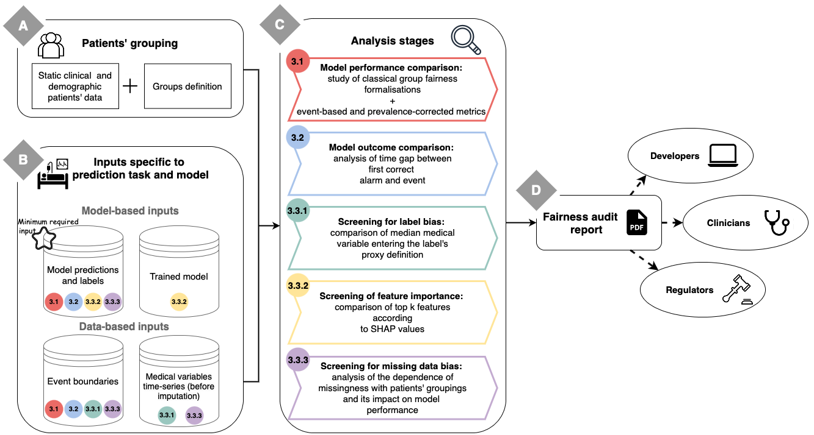

# FAMEWS: a Fairness Auditing tool for Medical Early-Warning Systems



## Setup

This repository depends on the work done by [Yèche et al. HiRID Benchmark](https://github.com/ratschlab/HIRID-ICU-Benchmark)
to preprocess the HiRID dataset and get it ready for model training, as well as inference and fairness analysis.

The [HiRID Benchmark](https://github.com/ratschlab/HIRID-ICU-Benchmark) repository with the preprocessing is included as a submodule in this repository. To clone the repository with the submodule, run:

```bash
git submodule init
git submodule update

# follow instructions in `HiRID Benchmark` repository to download and preprocess the dataset
# the subsequent steps rely on the different stage outputs defined by Yèche et al.
```

Then please follow the instructions of the HiRID Benchmark repository to obtain preprocessed data in a suitable format.

### Conda Environment

A conda environment configuration is provided: `environment_linux.yml`. You can create 
the environment with:
```
conda env create -f environment_linux.yml
conda activate famews
```

### Code Package

The `famews` package contains the relevant code components
for the pipeline. Install the package into your environment
with:
```
pip install -e ./famews
```

### Configurations

We use [Gin Configurations](https://github.com/google/gin-config/tags) to configure the
machine learning pipelines, preprocessing, and evaluation pipelines. Example configurations are in `./config`.  
Please note that some paths need to be completed in these configs based on where the preprocessing outputs have been saved.
To facilitate this step, they are all gathered under `# Paths preprocessed data` or `# Data parameter`.

## Pipeline Overview

Any task (preprocessing, training, evaluation, fairness analysis) is to be run with a script located in
`famews/scripts`. Ideally these scripts invoke a `Pipeline` object, which conists of different
`PipelineStage` objects.

### Preprocessing
 
#### HiRID

This repository depends on the work done by [Yèche et al. HiRID Benchmark](https://github.com/ratschlab/HIRID-ICU-Benchmark)
to preprocess the HiRID dataset and get it ready for model training, as well as inference and fairness analysis.

### ML Training

To facilitate experimentation, we provide model weights in `./data/models`.

#### LGBM model
To train a LGBM model, an example GIN config is available at `./config/lgbm_base_train.gin`.
Training can be performed with the following command:
```
python -m famews.scripts.train_tabular_model \
    -g ./config/lgbm_base_train.gin \
    -l ./logs/lgbm_base \
    --seed 1111
```

Pre-trained weights are available at `./data/models/lgbm` and can be used with the following command:
```
python -m famews.scripts.train_tabular_model \
    -g ./config/lgbm_base_pred.gin \
    -l ./logs/lgbm_base \
    --seed 1111
```
Note that these runs will also store in the log directory the predictions obtained on the test set.

You can launch several training with the `submit_wrapper.py` script. We encourage to do so to obtain model predictions from different random seeds (see config at `./config/lgbm_10seeds.yaml`).
The following command can be run:
```
python -m famews.scripts.submit_wrapper \
       --config ./config/lgbm_10seeds_train.yaml \
       -d ./logs/lgbm_10seeds
```

We also provide pre-trained weights for the LGBM models trained with 10 different random seeds in `./data/models/lgbm_10seeds`.
To generate the predictions from each of these models, one can lauch the `submit_wrapper_pred_models.py` script with the following command:
```
python -m famews.scripts.submit_wrapper_pred_models \
       --config ./config/lgbm_10seeds_pred.yaml \
       -d ./logs/lgbm_10seeds
```

#### LSTM model
To train a LSTM model, an example GIN config is available at `./config/lstm_base_train.gin`.
Training can be performed with the following command:
```
python -m famews.scripts.train_sequence_model \
    -g ./config/lstm_base_train.gin \
    -l ./logs/lstm_base \
    --seed 1111
```

Pre-trained weights are available at `./data/models/lstm` and can be used with the following command:
```
python -m famews.scripts.train_sequence_model \
    -g ./config/lstm_base_pred.gin \
    -l ./logs/lstm_base \
    --seed 1111
```
Note that these runs will also store in the log directory the predictions obtained on the test set.

### Fairness analysis
To audit the fairness of a model, we first need to obtain its predictions on the test set (see above commands) and to obtain certain preprocessed data (see Preprocessing section).  
For a more detailed documentation on the fairness analysis pipeline, see `./famews/famews/fairness_check/README.md`.
#### LGBM model
To audit an LGBM model, an example GIN config is available at `./config/lgbm_base_fairness.gin` and the following command can be run:
```
python -m famews.scripts.scripts.run_fairness_analysis \
    -g ./config/lgbm_base_fairness.gin \
    -l ./logs/lgbm_base/seed_1111 \
    --seed 1111
```

We encourage users to audit an averaged model obtained from models trained on different random seeds, an example GIN config is available at `./config/lgbm_10seeds_fairness.gin` and the following command can be run:
```
python -m famews.scripts.scripts.run_fairness_analysis \
    -g ./config/lgbm_10seeds_fairness.gin \
    -l ./logs/lgbm_10seeds \
    --seed 1111
```

#### LSTM model
To audit an LSTM model, an example GIN config is available at `./config/lstm_base_fairness.gin` and the following command can be run:
```
python -m famews.scripts.scripts.run_fairness_analysis \
    -g ./config/lstm_base_fairness.gin \
    -l ./logs/lstm_base/seed_1111 \
    --seed 1111
```
Please not that for this audit we don't run the `AnalyseFeatImportanceGroup` stage as it requires to compute the SHAP values and this isn't supported for DL learning model.  
However, if you still want to run this stage you can directly provide the SHAP values as input to the pipeline (see `./famews/famews/fairness_check/README.md` for more details).


